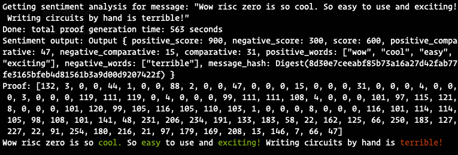

# zkSentiment Analysis

Sentiment analysis is a natural language processing technique used to identify and quantify emotions, opinions, or attitudes in textual data. It helps in gauging public sentiment on topics, analyzing customer feedback, and enhancing user experiences.

Sentiment analysis works by using machine learning algorithms or lexicon-based approaches to process and analyze textual data, identifying the underlying emotions, opinions, or attitudes. These algorithms can recognize linguistic patterns, keywords, and phrases, enabling the classification of text into positive, negative, or neutral sentiments.

## Running sentiment on-chain

Running any sentiment analysis inference on chain is infeasibly expensive because of the heavily constrained compute environment.

## Enter ZK

If you could prove the inference of some sentiment analysis in zk, you could get the sentiment data on chain while only verifying the correctness of a proof and avoiding the expensive computation.

This project uses the Risc Zero zkVM to generate a proof of correct computation of the sentiment results. This allows the smart contract to trust this input from off-chain and potentially take some interesting action on it.

## Try it yourself

Clone the repo:

``` bash
git clone git@github.com:rsproule/zk-sentiment.git
```

Run the prover:

``` bash
cargo run --release
```

This takes approximately 10 mins on my m2 macbook pro.



## Further work

Next step here is to do more interesting machine learning inference inside of risc zero circuits and post it on chain!
